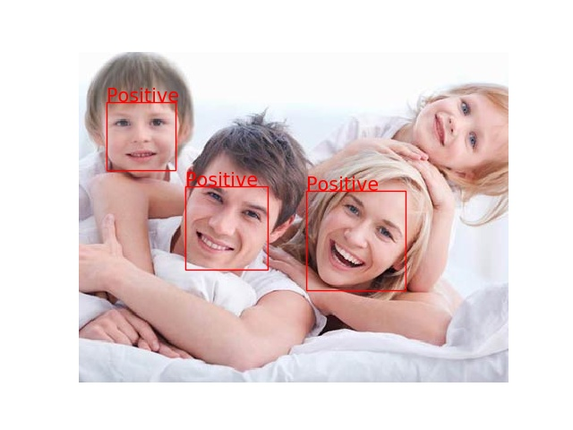
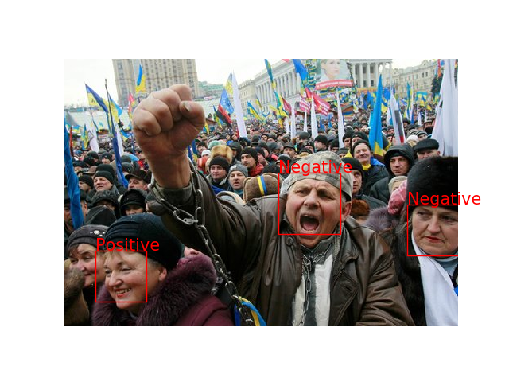

# EmotionRecognitionInTheWild2017
A ConvNet Model for recogntion of emotion 
Dataset is available at 

# Prerequisites
- Keras
- Tensorflow
- Numpy
- Matplotlib
- cv2
- dlib

# How to use
first run the extracFaces script for each folder of dataset to extract only faces in the dataset.
The Train Script with the right reffrence for data location.
The prediction script by fixing the location of the image:
```
path = '/path/to/image/'
imagename = '1.jpg'
```
# Prediction Samples
The trained model can be found here: 

<p align="center">
  
  
  
  
  
  
</p>
